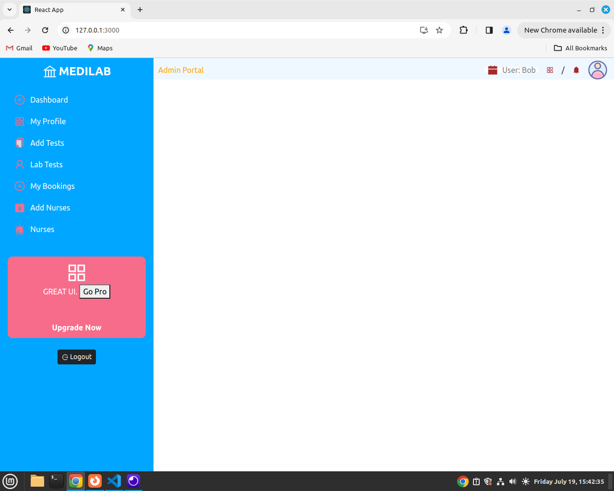

## Introduction

In this Git Repo, we create an admin Dashboard for Medilab. Please go through through  https://github.com/modcomlearning/medilab   to find out how to create an API used by this dashboard.   

Also, check https://github.com/modcomlearning/medilabapp  for the Android Mobile App 

This Dashboard will consume an APi created from https://github.com/modcomlearning/medilab  

## Getting Started with Create React App

This project was bootstrapped with [Create React App](https://github.com/facebook/create-react-app).

### Part 1
Create a react app named medilabDash, below are the command to use

#### Step 2 (optional)

    npm install -g create-react-app

#### Step 3

    npx create-react-app medilabDash

#### Step 4

    cd medilabDash

#### Step 5

    npm start

Access Your App through this link http://127.0.0.1:3000/  

#### Step 6 - Install Other Packages
While inside medilabDash Folder, Install below.

     npm install react-icons@latest

     npm install react-dom@latest

     npm install styled-components@latest

#### Step 7 - Directory Structure
First, ensure you are in your project's root directory and navigate to the src folder: (cd medilabDash/src). You can also create these folders by right clicking on src the new folder. 
Use the following commands to create the components, helpers, images, and styles folders.

Here’s how you can explain the purpose of each folder:

<b>components:</b> 
This folder will contain all the reusable React components. Components are the building blocks of your React application and are typically organized by feature or functionality.

<b>helpers:</b>
This folder is for utility functions and helper modules that can be used across the application. These might include functions for data manipulation, API calls, or other common tasks.

<b>images:</b>
This folder will store all the image assets used in your application. Organizing images in a separate folder helps in managing assets and improves the readability of your project structure.

<b>styles:</b>
This folder will contain all the stylesheets, whether you are using CSS, SCSS, or styled-components. Keeping styles in a dedicated folder helps maintain a clean and organized codebase.

### Part 2
In this Part, we will create All components needed in our Application, Use belo command to be inside the components folder.

    cd medilabDash/src/components

Then while in components, use below command to create all components.

      touch Signin.jsx Signup.jsx SideBar.jsx Topbar.jsx AddNurses.jsx AddTests.jsx LabTests.jsx MainContent.jsx MyBookings.jsx Nurses.jsx NursesDialog.jsx Profile.jsx

Below are the codes for each component.
#### Example for Each Component
##### 1. Signin.jsx

jsx

    import React from 'react';

    const Signin = () => {
    return (
        

        <h1>Signin</h1>
        

    );
    };

    export default Signin;

##### 2. Signup.jsx

jsx

    import React from 'react';

    const Signup = () => {
    return (
        

        <h1>Signup</h1>
        

    );
    };

    export default Signup;

##### 3. SideBar.jsx

jsx

    import React from 'react';

    const SideBar = () => {
    return (
        

        <h1>SideBar</h1>
        

    );
    };

    export default SideBar;

##### 4. Topbar.jsx

jsx

    import React from 'react';

    const Topbar = () => {
    return (
        

        <h1>Topbar</h1>
        

    );
    };

    export default Topbar;

##### 5. AddNurses.jsx

jsx

    import React from 'react';

    const AddNurses = () => {
    return (
        

        <h1>Add Nurses</h1>
        

    );
    };

    export default AddNurses;

##### 6. AddTests.jsx

jsx

    import React from 'react';

    const AddTests = () => {
    return (
        

        <h1>Add Tests</h1>
        

    );
    };

    export default AddTests;

##### 7. LabTests.jsx

jsx

    import React from 'react';

    const LabTests = () => {
    return (
        

        <h1>Lab Tests</h1>
        

    );
    };

    export default LabTests;

##### 8. MainContent.jsx

jsx

    import React from 'react';

    const MainContent = () => {
    return (
        

        <h1>Main Content</h1>
        

    );
    };

    export default MainContent;

##### 9. MyBookings.jsx

jsx

    import React from 'react';

    const MyBookings = () => {
    return (
        

        <h1>My Bookings</h1>
        

    );
    };

    export default MyBookings;

##### 10. Nurses.jsx

jsx

    import React from 'react';

    const Nurses = () => {
    return (
        

        <h1>Nurses</h1>
        

    );
    };

    export default Nurses;

##### 11. NursesDialog.jsx

jsx

    import React from 'react';

    const NursesDialog = () => {
    return (
        

        <h1>Nurses Dialog</h1>
        

    );
    };

export default NursesDialog;

##### 12. Profile.jsx

jsx

    import React from 'react';

    const Profile = () => {
    return (
        

        <h1>Profile</h1>
        

    );
    };

    export default Profile;

## Part 3
In App.js, Create a Router to define paths or routes to your created components.
Modify your App.js to loo line below code.

    import logo from './logo.svg';
    import './App.css';

    import { BrowserRouter as Router, Routes, Route } from 'react-router-dom';
    import MainContent from './components/MainContent';
    import Signin from './components/Signin';
    import Signup from './components/Signup';
    import AddNurses from './components/AddNurses';
    import Nurses from './components/Nurses';
    import AddTests from './components/AddTests';
    import LabTests from './components/LabTests';
    import Profile from './components/Profile';
    import MyBookings from './components/MyBookings';

    function App() {
    return (
        <Router>
        

        <Routes>
            <Route path='/' element = {<MainContent/>} ></Route>
            <Route path='/signin' element={<Signin />} ></Route>
            <Route path='/signup' element={<Signup />} ></Route>
            <Route path='/profile' element={<Profile />} ></Route>
            <Route path='/addnurses' element={<AddNurses />} ></Route>
            <Route path='/viewnurses' element={<Nurses />} ></Route>
            <Route path='/addtests' element={<AddTests />} ></Route>
            <Route path='/viewtests' element={<LabTests />} ></Route>
            <Route path='/mybookings' element={<MyBookings />} ></Route>
        </Routes>  

        

    </Router>
    );
    }

    export default App;

##### Explanation

    import logo from './logo.svg';
    import './App.css';

    import { BrowserRouter as Router, Routes, Route } from 'react-router-dom';
    import MainContent from './components/MainContent';
    import Signin from './components/Signin';
    import Signup from './components/Signup';
    import AddNurses from './components/AddNurses';
    import Nurses from './components/Nurses';
    import AddTests from './components/AddTests';
    import LabTests from './components/LabTests';
    import Profile from './components/Profile';
    import MyBookings from './components/MyBookings';

<b>Logo and CSS:</b>
logo.svg and App.css are imported for the application's logo and styling.

<b>React Router:</b>
BrowserRouter (aliased as Router), Routes, and Route are imported from react-router-dom for setting up client-side routing.

<b>Components:</b>
Various components (MainContent, Signin, Signup, etc.) are imported from the components folder.

    function App() {
    return (
        <Router>
        

            <Routes>
            <Route path='/' element={<MainContent />} />
            <Route path='/signin' element={<Signin />} />
            <Route path='/signup' element={<Signup />} />
            <Route path='/profile' element={<Profile />} />
            <Route path='/addnurses' element={<AddNurses />} />
            <Route path='/viewnurses' element={<Nurses />} />
            <Route path='/addtests' element={<AddTests />} />
            <Route path='/viewtests' element={<LabTests />} />
            <Route path='/mybookings' element={<MyBookings />} />
            </Routes>
        

        </Router>
    );
    }

<b>Router:</b>
The Router component wraps the entire application, enabling routing capabilities. It uses BrowserRouter under the hood, which uses the HTML5 history API to keep your UI in sync with the URL.

<b>Routes:</b>
The Routes component is a container for all Route components.

<b>Route Configuration:</b>
Each Route specifies a path and an element:  
path='/: Renders the MainContent component when the root URL (/) is accessed. 
path='/signin': Renders the Signin component when /signin is accessed. 
path='/signup': Renders the Signup component when /signup is accessed. 
path='/profile': Renders the Profile component when /profile is accessed. 
path='/addnurses': Renders the AddNurses component when /addnurses is accessed. 
path='/viewnurses': Renders the Nurses component when /viewnurses is accessed. 
path='/addtests': Renders the AddTests component when /addtests is accessed. 
path='/viewtests': Renders the LabTests component when /viewtests is accessed. 
path='/mybookings': Renders the MyBookings component when /mybookings is accessed. 

Now, Run you App and Access the routes you defined, example below shows how to Access sign up route

    http://127.0.0.1:3000/signup

Try out the rest.

## Part 3
In this Part, we start building our Components, Helpers and Styles.

Open TopBar.jsx and Update it by Adding below code.

    //Imports
    import styled from "styled-components"
    import { AiOutlineAppstore, AiFillBell } from "react-icons/ai"
    import { AiFillCalendar } from 'react-icons/ai';
    import Avatar from "../images/icon.png"
    const TobBar = () => {
    
        return (  
            <Nav>
            

                    Admin Portal          
                
    

                

                    

                        <AiFillCalendar />
                        {/* Below user will be updated once - Sign in is done */}
                        User: Bob    
                    

                    

                        <AiOutlineAppstore />
                        /
                        <AiFillBell />
                        

                            
                        

                        
                    

                

            </Nav>
        );
    }
    export default TobBar;
    // Below is the TopBar Style
    const Nav = styled.nav`
        display:flex ;
        position: fixed;
        z-index: 0;
        top:0;
        right: 0;
        justify-content: space-between;
        background-color: aliceblue;
        overflow: auto;
        width: 75%;
        .admin{
            color: orange;
            display: flex;
            margin-top: 5px; 
            align-items: center;
            margin-left: 10px;
            input{
                padding: 2%;
                border-radius: 1px;

            }
        }
        .content{
            display: flex;
            justify-content: space-between;
            margin-top: 5px; 
            align-items: center;
            .date{
                background-color: white;
                color: black;
                display: flex;
                align-items: center;
                padding: 0.3rem;
                height: 10px;
                span {
                    color: grey;
                }
                svg{
                    margin-right :8px;
                    color: brown;
                    font-size: 24px;
                }
            }
            .icon{
                display: flex;
                align-items: center;
                padding-left: 1rem;
                gap: 1rem;
                svg{
                color: brown;
                font-size:24px;
                }
                .image{
                    margin-right: 10%;
                    img{
                        color: aliceblue;
                        font-size: 24px;
                        width: 40px;
                        margin-right: 5%;
                    }
                }
            }

        }

    `

Test Above TopBar by Callin It in MainContent.jsx  Like below (This is for Testing Purposes)

    // src/components/MainContent.jsx

    import React from 'react';
    import TopBar from './TopBar';  // Import TopBar component

    const MainContent = () => {
    return (
        

        <TopBar />  {/* Include TopBar component */}
        <h1>Main Content</h1>
        
This is the main content of the page.

        

    );
    };

    export default MainContent;

Now Run and Access MainContent    http://127.0.0.1:3000/

## Part 4
In this part, we create the SideBar, Open SideBar.jsx and Update with below code.

        import React, { useState } from 'react';
        import styled from "styled-components"
        import { AiOutlineAppstore,AiFillAccountBook, AiFillAlert, AiOutlineLogout } from "react-icons/ai"
        import {AiOutlineBank, AiOutlinePlusCircle, AiOutlineUser} from "react-icons/ai"
        import {AiTwotoneCopy}  from "react-icons/ai"
        import { Link } from "react-router-dom"
        import ReactLogout from '../helpers/ReactLogout';
        // import ReactLogout from '../helpers/ReactLogout';
        //sudo npm install react-router-dom@latest
        //style
        const Section = styled.section`
            background-color: #00a6ff;
            display: flex;
            position: fixed;
            overflow: auto;
            z-index: 1;
            flex-direction: column;
            width: 25vw;
            left: 0;
            height: 100%;
            align-items: center;
            padding-top:10px;
            .top{
                display:flex ;
                flex-direction: column;
                width: 100%;
                .brand{
                    width: 100%;
                    display: flex;
                    justify-content:center;
                    align-items: center;
                    span{
                        font-size: 1.5rem;
                        color: white;
                        font-weight:bold;
                    }  
                    svg{
                        color: aliceblue;
                        font-size: 2rem;
                        margin-right: 2px;
                    }
                }//end brand
            
                .links{
                    display: flex;
                    flex-direction: column;
                    ul{
                        list-style-type: none;
                        padding: 1rem;
                        li {
                        padding: 0.5rem;
                        margin:5px;
                        border-radius: 0.5rem;
                        text-align: left;
                        &:hover{
                            background-color: black;
                            a{
                                color: white;
                                text-decoration: none  ;
                            }
                        }//end hover
                        a{
                            color:#fafcfd;
                            text-decoration: none;
                            display: flex;
                            align-items: center;
                            svg{
                                fill: #f76c8a;
                                font-size: 1.5rem;
                                margin-right: 10px;
                            } 
                        }
                        }//end li
                    }//end ul     
                
                    
                }//end links
            } //end top 

            .bottom{
                width: 90%;
                display: flex;
                flex-direction: column;
                padding: 10px;
                justify-content: center;
                background-color: #f76c8a;
                align-items: center;
                border-radius : 10px;
                    svg{
                        fill: #fafcfd;
                        font-size: 3rem;
                    }
                    span{
                        color: white;
                    }
                }//end bottom
                .logout{
                    display:flex;
                    background-color: white;
                    padding: 5px; width: 6em; display: inline;
                    margin-top: 10px; margin-bottom: 10px;
                    a{
                        text-decoration: none;   
                    }
                }
        `
        //Style End here

        const SideBar = () => {
        
            return ( 
                <Section>
                    

                        

                            <AiOutlineBank />
                            MEDILAB
                        

                        
                        

                            <ul>
                                <li>
                                    <Link to="/"><AiOutlinePlusCircle/>Dashboard</Link>
                                </li>
                                <li>
                                    <Link to="/profile"><AiOutlineAppstore/>My Profile</Link>
                                </li>
                                <li>
                                    <Link to="/addtests"><AiTwotoneCopy/>Add Tests</Link>
                                </li>
                                <li>
                                    <Link to="/viewtests"><AiOutlineUser />Lab Tests</Link>
                                </li>
                                <li>
                                    <Link to="/mybookings"><AiOutlinePlusCircle/>My Bookings</Link>
                                </li>
                                <li>
                                    <Link to="/addnurses"><AiFillAccountBook/>Add Nurses</Link>
                                </li>

                                <li>
                                    <Link to="/viewnurses"><AiFillAlert/>Nurses</Link>
                                </li>
                            </ul>                    
                        

                    
    
                    {/* End Topdiv */}
                    

                        <AiOutlineAppstore />
                        GREAT UI. <button>Go Pro</button>  
                         
                        <strong>Upgrade Now</strong>
                    

                    

                        <button onClick="" className="btn btn-dark btn-sm">
                            <AiOutlineLogout /> Logout
                        </button>
                    

                </Section>

            );
        }

        export default SideBar;

Call the SideBar in MainContent, Add It Below the TopBar in below code.

     // src/components/MainContent.jsx

    import React from 'react';
    import TopBar from './TopBar';  // Import TopBar component

    const MainContent = () => {
    return (
        

        <TopBar />  {/* Include TopBar component */}
        <SideBar />  {/* Include SideBar component */}

        <h1>Main Content</h1>
        
This is the main content of the page.

        

    );
    };

    export default MainContent;

Now Run and Access MainContent    http://127.0.0.1:3000/

## Available Scripts

In the project directory, you can run:

### `npm start`

Runs the app in the development mode.\
Open [http://localhost:3000](http://localhost:3000) to view it in your browser.

The page will reload when you make changes.\
You may also see any lint errors in the console.

### `npm test`

Launches the test runner in the interactive watch mode.\
See the section about [running tests](https://facebook.github.io/create-react-app/docs/running-tests) for more information.

### `npm run build`

Builds the app for production to the `build` folder.\
It correctly bundles React in production mode and optimizes the build for the best performance.

The build is minified and the filenames include the hashes.\
Your app is ready to be deployed!

See the section about [deployment](https://facebook.github.io/create-react-app/docs/deployment) for more information.

### `npm run eject`

**Note: this is a one-way operation. Once you `eject`, you can't go back!**

If you aren't satisfied with the build tool and configuration choices, you can `eject` at any time. This command will remove the single build dependency from your project.

Instead, it will copy all the configuration files and the transitive dependencies (webpack, Babel, ESLint, etc) right into your project so you have full control over them. All of the commands except `eject` will still work, but they will point to the copied scripts so you can tweak them. At this point you're on your own.

You don't have to ever use `eject`. The curated feature set is suitable for small and middle deployments, and you shouldn't feel obligated to use this feature. However we understand that this tool wouldn't be useful if you couldn't customize it when you are ready for it.

## Learn More

You can learn more in the [Create React App documentation](https://facebook.github.io/create-react-app/docs/getting-started).

To learn React, check out the [React documentation](https://reactjs.org/).

### Code Splitting

This section has moved here: [https://facebook.github.io/create-react-app/docs/code-splitting](https://facebook.github.io/create-react-app/docs/code-splitting)

### Analyzing the Bundle Size

This section has moved here: [https://facebook.github.io/create-react-app/docs/analyzing-the-bundle-size](https://facebook.github.io/create-react-app/docs/analyzing-the-bundle-size)

### Making a Progressive Web App

This section has moved here: [https://facebook.github.io/create-react-app/docs/making-a-progressive-web-app](https://facebook.github.io/create-react-app/docs/making-a-progressive-web-app)

### Advanced Configuration

This section has moved here: [https://facebook.github.io/create-react-app/docs/advanced-configuration](https://facebook.github.io/create-react-app/docs/advanced-configuration)

### Deployment

This section has moved here: [https://facebook.github.io/create-react-app/docs/deployment](https://facebook.github.io/create-react-app/docs/deployment)

### `npm run build` fails to minify

This section has moved here: [https://facebook.github.io/create-react-app/docs/troubleshooting#npm-run-build-fails-to-minify](https://facebook.github.io/create-react-app/docs/troubleshooting#npm-run-build-fails-to-minify)
