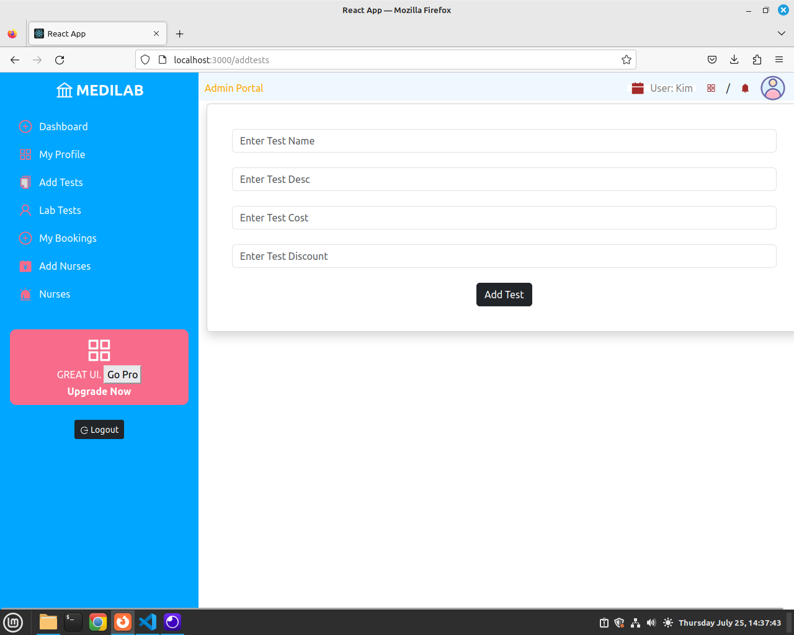

## Introduction

In this Git Repo, we create an admin Dashboard for Medilab. Please go through through  https://github.com/modcomlearning/medilab   to find out how to create an API used by this dashboard.   

Also, check https://github.com/modcomlearning/medilabapp  for the Android Mobile App 

This Dashboard will consume an APi created from https://github.com/modcomlearning/medilab  

## Getting Started with Create React App

This project was bootstrapped with [Create React App](https://github.com/facebook/create-react-app).

### Part 1
Create a react app named medilabDash, below are the command to use

#### Step 2 (optional)

    npm install -g create-react-app

#### Step 3

    npx create-react-app medilabDash

#### Step 4

    cd medilabDash

#### Step 5

    npm start

Access Your App through this link http://127.0.0.1:3000/  

#### Step 6 - Install Other Packages
While inside medilabDash Folder, Install below.

     npm install react-icons@latest

     npm install react-dom@latest

     npm install styled-components@latest

#### Step 7 - Directory Structure
First, ensure you are in your project's root directory and navigate to the src folder: (cd medilabDash/src). You can also create these folders by right clicking on src the new folder. 
Use the following commands to create the components, helpers, images, and styles folders.

Here’s how you can explain the purpose of each folder:

<b>components:</b> 
This folder will contain all the reusable React components. Components are the building blocks of your React application and are typically organized by feature or functionality.

<b>helpers:</b>
This folder is for utility functions and helper modules that can be used across the application. These might include functions for data manipulation, API calls, or other common tasks.

<b>images:</b>
This folder will store all the image assets used in your application. Organizing images in a separate folder helps in managing assets and improves the readability of your project structure.

<b>styles:</b>
This folder will contain all the stylesheets, whether you are using CSS, SCSS, or styled-components. Keeping styles in a dedicated folder helps maintain a clean and organized codebase.

### Part 2
In this Part, we will create All components needed in our Application, Use belo command to be inside the components folder.

    cd medilabDash/src/components

Then while in components, use below command to create all components.

      touch Signin.jsx Signup.jsx SideBar.jsx Topbar.jsx AddNurses.jsx AddTests.jsx LabTests.jsx MainContent.jsx MyBookings.jsx Nurses.jsx NursesDialog.jsx Profile.jsx

Below are the codes for each component.
#### Example for Each Component
##### 1. Signin.jsx

jsx

    import React from 'react';

    const Signin = () => {
    return (
        

        <h1>Signin</h1>
        

    );
    };

    export default Signin;

##### 2. Signup.jsx

jsx

    import React from 'react';

    const Signup = () => {
    return (
        

        <h1>Signup</h1>
        

    );
    };

    export default Signup;

##### 3. SideBar.jsx

jsx

    import React from 'react';

    const SideBar = () => {
    return (
        

        <h1>SideBar</h1>
        

    );
    };

    export default SideBar;

##### 4. Topbar.jsx

jsx

    import React from 'react';

    const Topbar = () => {
    return (
        

        <h1>Topbar</h1>
        

    );
    };

    export default Topbar;

##### 5. AddNurses.jsx

jsx

    import React from 'react';

    const AddNurses = () => {
    return (
        

        <h1>Add Nurses</h1>
        

    );
    };

    export default AddNurses;

##### 6. AddTests.jsx

jsx

    import React from 'react';

    const AddTests = () => {
    return (
        

        <h1>Add Tests</h1>
        

    );
    };

    export default AddTests;

##### 7. LabTests.jsx

jsx

    import React from 'react';

    const LabTests = () => {
    return (
        

        <h1>Lab Tests</h1>
        

    );
    };

    export default LabTests;

##### 8. MainContent.jsx

jsx

    import React from 'react';

    const MainContent = () => {
    return (
        

        <h1>Main Content</h1>
        

    );
    };

    export default MainContent;

##### 9. MyBookings.jsx

jsx

    import React from 'react';

    const MyBookings = () => {
    return (
        

        <h1>My Bookings</h1>
        

    );
    };

    export default MyBookings;

##### 10. Nurses.jsx

jsx

    import React from 'react';

    const Nurses = () => {
    return (
        

        <h1>Nurses</h1>
        

    );
    };

    export default Nurses;

##### 11. NursesDialog.jsx

jsx

    import React from 'react';

    const NursesDialog = () => {
    return (
        

        <h1>Nurses Dialog</h1>
        

    );
    };

export default NursesDialog;

##### 12. Profile.jsx

jsx

    import React from 'react';

    const Profile = () => {
    return (
        

        <h1>Profile</h1>
        

    );
    };

    export default Profile;

## Part 3
In App.js, Create a Router to define paths or routes to your created components.
Modify your App.js to loo line below code.

    import logo from './logo.svg';
    import './App.css';

    import { BrowserRouter as Router, Routes, Route } from 'react-router-dom';
    import MainContent from './components/MainContent';
    import Signin from './components/Signin';
    import Signup from './components/Signup';
    import AddNurses from './components/AddNurses';
    import Nurses from './components/Nurses';
    import AddTests from './components/AddTests';
    import LabTests from './components/LabTests';
    import Profile from './components/Profile';
    import MyBookings from './components/MyBookings';

    function App() {
    return (
        <Router>
        

        <Routes>
            <Route path='/' element = {<MainContent/>} ></Route>
            <Route path='/signin' element={<Signin />} ></Route>
            <Route path='/signup' element={<Signup />} ></Route>
            <Route path='/profile' element={<Profile />} ></Route>
            <Route path='/addnurses' element={<AddNurses />} ></Route>
            <Route path='/viewnurses' element={<Nurses />} ></Route>
            <Route path='/addtests' element={<AddTests />} ></Route>
            <Route path='/viewtests' element={<LabTests />} ></Route>
            <Route path='/mybookings' element={<MyBookings />} ></Route>
        </Routes>  

        

    </Router>
    );
    }

    export default App;

##### Explanation

    import logo from './logo.svg';
    import './App.css';

    import { BrowserRouter as Router, Routes, Route } from 'react-router-dom';
    import MainContent from './components/MainContent';
    import Signin from './components/Signin';
    import Signup from './components/Signup';
    import AddNurses from './components/AddNurses';
    import Nurses from './components/Nurses';
    import AddTests from './components/AddTests';
    import LabTests from './components/LabTests';
    import Profile from './components/Profile';
    import MyBookings from './components/MyBookings';

<b>Logo and CSS:</b>
logo.svg and App.css are imported for the application's logo and styling.

<b>React Router:</b>
BrowserRouter (aliased as Router), Routes, and Route are imported from react-router-dom for setting up client-side routing.

<b>Components:</b>
Various components (MainContent, Signin, Signup, etc.) are imported from the components folder.

    function App() {
    return (
        <Router>
        

            <Routes>
            <Route path='/' element={<MainContent />} />
            <Route path='/signin' element={<Signin />} />
            <Route path='/signup' element={<Signup />} />
            <Route path='/profile' element={<Profile />} />
            <Route path='/addnurses' element={<AddNurses />} />
            <Route path='/viewnurses' element={<Nurses />} />
            <Route path='/addtests' element={<AddTests />} />
            <Route path='/viewtests' element={<LabTests />} />
            <Route path='/mybookings' element={<MyBookings />} />
            </Routes>
        

        </Router>
    );
    }

<b>Router:</b>
The Router component wraps the entire application, enabling routing capabilities. It uses BrowserRouter under the hood, which uses the HTML5 history API to keep your UI in sync with the URL.

<b>Routes:</b>
The Routes component is a container for all Route components.

<b>Route Configuration:</b>
Each Route specifies a path and an element:  
path='/: Renders the MainContent component when the root URL (/) is accessed. 
path='/signin': Renders the Signin component when /signin is accessed. 
path='/signup': Renders the Signup component when /signup is accessed. 
path='/profile': Renders the Profile component when /profile is accessed. 
path='/addnurses': Renders the AddNurses component when /addnurses is accessed. 
path='/viewnurses': Renders the Nurses component when /viewnurses is accessed. 
path='/addtests': Renders the AddTests component when /addtests is accessed. 
path='/viewtests': Renders the LabTests component when /viewtests is accessed. 
path='/mybookings': Renders the MyBookings component when /mybookings is accessed. 

Now, Run you App and Access the routes you defined, example below shows how to Access sign up route

    http://127.0.0.1:3000/signup

Try out the rest.

## Part 3
In this Part, we start building our Components, Helpers and Styles.

Open TopBar.jsx and Update it by Adding below code.

    //Imports
    import styled from "styled-components"
    import { AiOutlineAppstore, AiFillBell } from "react-icons/ai"
    import { AiFillCalendar } from 'react-icons/ai';
    import Avatar from "../images/icon.png"
    const TobBar = () => {
    
        return (  
            <Nav>
            

                    Admin Portal          
                
    

                

                    

                        <AiFillCalendar />
                        {/* Below user will be updated once - Sign in is done */}
                        User: Bob    
                    

                    

                        <AiOutlineAppstore />
                        /
                        <AiFillBell />
                        

                            
                        

                        
                    

                

            </Nav>
        );
    }
    export default TobBar;
    // Below is the TopBar Style
    const Nav = styled.nav`
        display:flex ;
        position: fixed;
        z-index: 0;
        top:0;
        right: 0;
        justify-content: space-between;
        background-color: aliceblue;
        overflow: auto;
        width: 75%;
        .admin{
            color: orange;
            display: flex;
            margin-top: 5px; 
            align-items: center;
            margin-left: 10px;
            input{
                padding: 2%;
                border-radius: 1px;

            }
        }
        .content{
            display: flex;
            justify-content: space-between;
            margin-top: 5px; 
            align-items: center;
            .date{
                background-color: white;
                color: black;
                display: flex;
                align-items: center;
                padding: 0.3rem;
                height: 10px;
                span {
                    color: grey;
                }
                svg{
                    margin-right :8px;
                    color: brown;
                    font-size: 24px;
                }
            }
            .icon{
                display: flex;
                align-items: center;
                padding-left: 1rem;
                gap: 1rem;
                svg{
                color: brown;
                font-size:24px;
                }
                .image{
                    margin-right: 10%;
                    img{
                        color: aliceblue;
                        font-size: 24px;
                        width: 40px;
                        margin-right: 5%;
                    }
                }
            }

        }

    `

Test Above TopBar by Callin It in MainContent.jsx  Like below (This is for Testing Purposes)

    // src/components/MainContent.jsx

    import React from 'react';
    import TopBar from './TopBar';  // Import TopBar component

    const MainContent = () => {
    return (
        

        <TopBar />  {/* Include TopBar component */}
        <h1>Main Content</h1>
        
This is the main content of the page.

        

    );
    };

    export default MainContent;

Now Run and Access MainContent    http://127.0.0.1:3000/

## Part 4
In this part, we create the SideBar, Open SideBar.jsx and Update with below code.

        import React, { useState } from 'react';
        import styled from "styled-components"
        import { AiOutlineAppstore,AiFillAccountBook, AiFillAlert, AiOutlineLogout } from "react-icons/ai"
        import {AiOutlineBank, AiOutlinePlusCircle, AiOutlineUser} from "react-icons/ai"
        import {AiTwotoneCopy}  from "react-icons/ai"
        import { Link } from "react-router-dom"
        import ReactLogout from '../helpers/ReactLogout';
        // import ReactLogout from '../helpers/ReactLogout';
        //sudo npm install react-router-dom@latest
        //style
        const Section = styled.section`
            background-color: #00a6ff;
            display: flex;
            position: fixed;
            overflow: auto;
            z-index: 1;
            flex-direction: column;
            width: 25vw;
            left: 0;
            height: 100%;
            align-items: center;
            padding-top:10px;
            .top{
                display:flex ;
                flex-direction: column;
                width: 100%;
                .brand{
                    width: 100%;
                    display: flex;
                    justify-content:center;
                    align-items: center;
                    span{
                        font-size: 1.5rem;
                        color: white;
                        font-weight:bold;
                    }  
                    svg{
                        color: aliceblue;
                        font-size: 2rem;
                        margin-right: 2px;
                    }
                }//end brand
            
                .links{
                    display: flex;
                    flex-direction: column;
                    ul{
                        list-style-type: none;
                        padding: 1rem;
                        li {
                        padding: 0.5rem;
                        margin:5px;
                        border-radius: 0.5rem;
                        text-align: left;
                        &:hover{
                            background-color: black;
                            a{
                                color: white;
                                text-decoration: none  ;
                            }
                        }//end hover
                        a{
                            color:#fafcfd;
                            text-decoration: none;
                            display: flex;
                            align-items: center;
                            svg{
                                fill: #f76c8a;
                                font-size: 1.5rem;
                                margin-right: 10px;
                            } 
                        }
                        }//end li
                    }//end ul     
                
                    
                }//end links
            } //end top 

            .bottom{
                width: 90%;
                display: flex;
                flex-direction: column;
                padding: 10px;
                justify-content: center;
                background-color: #f76c8a;
                align-items: center;
                border-radius : 10px;
                    svg{
                        fill: #fafcfd;
                        font-size: 3rem;
                    }
                    span{
                        color: white;
                    }
                }//end bottom
                .logout{
                    display:flex;
                    background-color: white;
                    padding: 5px; width: 6em; display: inline;
                    margin-top: 10px; margin-bottom: 10px;
                    a{
                        text-decoration: none;   
                    }
                }
        `
        //Style End here

        const SideBar = () => {
        
            return ( 
                <Section>
                    

                        

                            <AiOutlineBank />
                            MEDILAB
                        

                        
                        

                            <ul>
                                <li>
                                    <Link to="/"><AiOutlinePlusCircle/>Dashboard</Link>
                                </li>
                                <li>
                                    <Link to="/profile"><AiOutlineAppstore/>My Profile</Link>
                                </li>
                                <li>
                                    <Link to="/addtests"><AiTwotoneCopy/>Add Tests</Link>
                                </li>
                                <li>
                                    <Link to="/viewtests"><AiOutlineUser />Lab Tests</Link>
                                </li>
                                <li>
                                    <Link to="/mybookings"><AiOutlinePlusCircle/>My Bookings</Link>
                                </li>
                                <li>
                                    <Link to="/addnurses"><AiFillAccountBook/>Add Nurses</Link>
                                </li>

                                <li>
                                    <Link to="/viewnurses"><AiFillAlert/>Nurses</Link>
                                </li>
                            </ul>                    
                        

                    
    
                    {/* End Topdiv */}
                    

                        <AiOutlineAppstore />
                        GREAT UI. <button>Go Pro</button>  
                         
                        <strong>Upgrade Now</strong>
                    

                    

                        <button onClick="" className="btn btn-dark btn-sm">
                            <AiOutlineLogout /> Logout
                        </button>
                    

                </Section>

            );
        }

        export default SideBar;

Call the SideBar in MainContent, Add it Below the Before TopBar in below code.

     // src/components/MainContent.jsx

    import React from 'react';
    import TopBar from './TopBar';  // Import TopBar component

    const MainContent = () => {
    return (
        

        <SideBar />  {/* Include SideBar component */}
        <TopBar />  {/* Include TopBar component */}
        

        <h1>Main Content</h1>
        
This is the main content of the page.

        

    );
    };

    export default MainContent;

Now Run and Access MainContent    http://127.0.0.1:3000/

## Part 5
Instead of having the Top Bar and SideBar included Individually in MainContent, we can combine them in one Component named Layout, then Call the Layout component in MainContent.

Create a File named Layout.jsx in helpers Folder, Add below code.

    import SideBar from "../components/SideBar";
    import TopBar from "../components/TopBar";
    // This will render side bar and topbar
    const Layout = () => {
        return (  
            

                <SideBar />
                <TopBar/>
            

        );
    }
    
    export default Layout;

Now in MainContent.jsx, Just call the Layout component like below.

     // src/components/MainContent.jsx

    import React from 'react';
    import Layout from '../helpers/Layout';

    const MainContent = () => {
    return (
        

        <Layout />  {/* Include Layout component which has SideBar and TopBar*/}

        <h1>Main Content</h1>
        
This is the main content of the page.

        

    );
    };

    export default MainContent;

Next we need to Create and Style the Content for MainContent, Here we will use a styled components to position the MainContent below the TopBar and to the Right of SideBar.

In styles folder, create a file named Main.jsx and Add below code.

    import styled from "styled-components"
    const Main = styled.section`
        display: flex;
        flex-direction: column;
        background-color: #f7fafb;
        margin-left: 26%;
        width: 75%;
        position: relative;
        top: 50px;
    `
    export default Main;

Above Main.jsx will be used in MainContent to Style the MainContent.
Below is the Updated MainContent.jsx

        import Main from '../styles/Main';
        import Layout from '../helpers/Layout';
        const MainContent = () => {

            return ( 
                

                    {/* Include Side and Top Bars */}
                    <Layout/>
                    {/* Include Main, the styled component, put some divs inside the Main */}
                    <Main>
                        

                            <h1>Dashboard</h1>
                            

                                

                                    

                                        Creative 
                                        

                                            
                                        

                                    

                                

                                

                                    

                                        Affordable 
                                        

                                            
                                        

                                    

                                

                                

                                    

                                        Efficient 
                                        

                                            
                                        

                                    

                                

                            

                        

                    </Main>
                

            
            );
        }
        
        export default MainContent;

    
Now Run and Access MainContent    http://127.0.0.1:3000/

The output has the SideBar, TopBar and The MainContent.

## Part 6
### Step 1
In this step, we create the Sign Up Component.  

To Post data to API, we use axios  https://axios-http.com/docs/intro   

First install axios, In Terminal change directory to your application folder and use below command.

     sudo npm install axios

In helpers Folder, Create a File named axiosInstance.jsx and write below code

    import axios from 'axios';
    const axiosInstance = axios.create({
        baseURL: 'https://pebu.pythonanywhere.com/api',
        headers: {
            'Content-Type': 'application/json'
        }
    });

    export default axiosInstance;

Above code snippet creates and exports an instance of Axios, pre-configured with a base URL and headers. This setup is useful for making HTTP requests to the specified API without having to repeat the base URL and headers for each request.  NB: Please use your API EndPoint.

Next,  Open Signup.jsx and Update it with below code.

        import { useState } from "react";
        import { styled } from "styled-components";
        import { Link } from "react-router-dom";
        import axiosInstance from "../helpers/axiosInstance";
        const Signup = () => {
            //States - Hooks
            const [lab_name, setName] = useState(null)
            const [permit_id, setPermit] = useState(null)
            const [email, setEmail] = useState(null)
            const [phone, setPhone] = useState(null)
            const [password, setPassword] = useState(null)
            const [loading, setLoading] = useState(false)
            const [success, setSuccess] = useState(null)
            const [failure, setFailure] = useState(null)

            //Action when submit button is pressed
            const submit = (e) => {
                e.preventDefault();
                setLoading(true)
                setSuccess(null)
                setFailure(null)
                console.log("submitting")
                    //Use Axios instance to post data to API
                    axiosInstance.post('/labsignup', {
                        lab_name: lab_name,
                        permit_id: permit_id,
                        email: email,
                        phone: phone,
                        password:password
                    })
                    .then(function (response) {
                        console.log(response.data.message);
                        //Update hooks accordingly 
                        setLoading(false)
                        setSuccess(response.data.message)
                    
                        //Set Hooks to Empty the Fields after save
                        setEmail(''); setName(''); setPassword(''); setPhone(''); setPermit('');
                    })
                    .catch(function (error) {
                        console.log(error.message);
                        setLoading(false)
                        setFailure(error.message);
                    });

            }//End submit
            return ( 
                

            
                    <Section>
                
                    {loading  && 
 Please Wait..
}
                    {success && 
 {success}
}  
                    {failure && 
 { failure}
}  
                        <form onSubmit={submit} className="card shadow p-3 pt-4">
                            <h1>Register Lab</h1>
                            

                        <input type="text" placeholder="Enter Lab Name" value={lab_name}
                                    onChange={(e) => setName(e.target.value)} required
                                className="form-control"/>  
                    
                        <input type="text" placeholder="Enter Permit ID" value={permit_id}
                                    onChange={(e) => setPermit(e.target.value)} required
                                className="form-control"/>  
                        
                        <input type="email" placeholder="Enter Email" value={email}
                                    onChange={(e) => setEmail(e.target.value)} required
                                    className="form-control" />  
                        
                        <input type="tel" placeholder="Enter Phone" value={phone}
                                    onChange={(e) => setPhone(e.target.value)} required
                                className="form-control"/>  
                    
                        <input type="password" placeholder="Enter Password" value={password}
                                    onChange={(e) => setPassword(e.target.value)} required
                                className="form-control"/>  

                        <button className="btn btn-dark">Create Account</button>
                            

                            <Link to="/signin">Already have an Account, Login</Link>
                        </form>
                    </Section>
                

            );
        }
        
        export default Signup;
        //This is a styled component  to position the form
        const Section = styled.section`
            display: flex;
            flex-direction: column;
            position: relative;
            align-items: center;
            justify-content: center;
            top: 50px;
            overflow: auto;
        `

Now Run and Access SignUp    http://127.0.0.1:3000/signup   

Read on LocalStorage as it will be used in Next Step   https://www.freecodecamp.org/news/use-local-storage-in-modern-applications/

### Step 2
In this step we create a Signin.jsx component  
Open your Signin.jsx and write below code.   

      
    // Imports
    import React, { useState } from "react";
    import styled from "styled-components";
    import { Link, useNavigate } from 'react-router-dom';
    import axiosInstance from "../helpers/axiosInstance";

    const Signin = () => {
        //navigate used in page redirection
        const navigate = useNavigate();
        //States - Hooks
        const [email, setEmail] = useState(null);
        const [password, setPassword] = useState(null);
        const [loading, setLoading] = useState(false);
        const [success, setSuccess] = useState(null);
        const [failure, setFailure] = useState(null);

        //Action when submit button is pressed
        const submit = (e) => {
            e.preventDefault();
            setLoading(true);
            setSuccess(null);
            setFailure(null);
            console.log("Submitting");

            //Use Axios instance to post data to API
            axiosInstance.post('/labsignin', {
                email: email,
                password: password
            })
            .then(function (response) {
                console.log("Response received:", response.data);
                setLoading(false); //update hook
                //Handle response
                if (response.data && response.data.member && response.data.access_token) {
                    //Above - Check that data is available
                    console.log("Login successful:", response.data.member);
                    //Save Data to Local Storage
                    localStorage.setItem("lab_id", response.data.member.lab_id);
                    localStorage.setItem("lab_name", response.data.member.lab_name);    
                    localStorage.setItem("access_token", response.data.access_token);
                    setSuccess(response.data.member); //update success hook

                    navigate("/"); // use navigate to Redirect to main content
                } else {
                    //Login has failed
                    console.log("Login Failed, No token received");
                    setFailure("Login Failed, No token received");
                }
            })
            .catch(function (error) {
                console.error("Error occurred:", error.message);
                setLoading(false);//update hook
                setFailure(error.message); //update hook
            });
        }

        return (
            

                <Section>
                    {loading && 
Please Wait...
}
                    {success && 
{success.lab_name} logged in successfully
}
                    {failure && 
{failure}
}
                    <form onSubmit={submit} className="card shadow p-3 pt-4">
                        <h1>Login Lab</h1>
                        

                            <input
                                type="email"
                                placeholder="Enter Email"
                                value={email}
                                onChange={(e) => setEmail(e.target.value)}
                                required
                                className="form-control"
                            />
                             
                            <input
                                type="password"
                                placeholder="Enter Password"
                                value={password}
                                onChange={(e) => setPassword(e.target.value)}
                                required
                                className="form-control"
                            />
                             
                            <button className="btn btn-dark" type="submit">Login Account</button>
                        

                        <Link to="/signup">Don't have an Account? Create one</Link>
                    </form>
                </Section>
            

        );
    }

    export default Signin;
    //This is a styled component  to position the form
    const Section = styled.section`
        display: flex;
        flex-direction: column;
        position: relative;
        align-items: center;
        justify-content: center;
        top: 50px;
    `;

Run and Access Signin    http://127.0.0.1:3000/signin  
Test after successul Login, it navigates to Dashboard  with SIdebar, Topbar and MainContent  

After doing the Login and Confirm it takes you to Dashboard on successful Login, Open the TopBar.jsx  

Access lab_name from local storage, Add This Code below the TopBar Component Function defination

       //access labname from top bar
       const lab_name = localStorage.getItem("lab_name")

Then update the Logged in User from a static user to a dynamic user by binding the lab_name

        span>User: { lab_name }

Your Complete and Updated TopBar.jsx looks like below

        //Imports
        import styled from "styled-components"
        import { AiOutlineAppstore, AiFillBell } from "react-icons/ai"
        import { AiFillCalendar } from 'react-icons/ai';
        import Avatar from "../images/icon.png"
        const TobBar = () => {
            //access labname from top bar 
            const lab_name = localStorage.getItem("lab_name")  //******ADDED THIS LINE******
            return (  
                <Nav>
                

                        Admin Portal          
                    
    

                    

                        

                            <AiFillCalendar />
                            {/* *******UPDATED BELOW******* */}
                            User: { lab_name }  
                        

                        

                            <AiOutlineAppstore />
                            /
                            <AiFillBell />
                            

                                
                            

                            
                        

                    

                </Nav>
            );
        }
        export default TobBar;
        //NB: The styled Component below was not affected or changed. ONLY 2 lines indicated with *** Comments above were affected
        const Nav = styled.nav`
           ....
        `

Run the Code and Access Signin, Signin with correct credentials  
Observe in the dashboard the Logged in lab_name is displayed at the Top Right of the TopBar. 
An example - below Screen shows Kim is the Lab Name Logged In.  Try Signup and Signin with a New Lab and Observe that the TopBar will reflect the New Logged in Lab name.

### Step 3
We create a component to help us check if user is logged in or Not  
In helpers Folder, Create a File named CheckSession.jsx and write below code.

    import { useEffect } from "react"
    import { useNavigate } from "react-router-dom"

    const CheckSession = () => {
        const navigation = useNavigate()//**
            //useEffect runs at least  once when page loads   
            // THis Code check from Local Storage if below 3 variables arew present
            const lab_name = localStorage.getItem("lab_name")
            const lab_id = localStorage.getItem("lab_id")
            const access_token = localStorage.getItem("access_token")

            //If they are present/Not Empty, it returns them.
            //If they are not Present/Empty it Goes to /signin
            useEffect(() => {
                //check if above are empty
                if (!lab_name && !lab_id && !access_token) {
                    console.log("Works")
                    localStorage.clear();
                    return navigation("/signin")//Go to sign
                }
            }, [lab_name, lab_id, access_token, navigation]); //Return them
        
        //return your variables
        return {lab_name, lab_id, access_token}
    }
    
    export default CheckSession;

Any Component that uses this CheckSession will receive the lab_name, lab_id, access_token 
If a User is logged in,ELse it will navigate to signin 
We will be using this Component to check if user is logged in or not. 

To test above code Go to MainContent and add below code, Just below the Defination of your component 

        import CheckSession from '../helpers/CheckSession';   //Import this
        const MainContent = () => {   //This is your MainContent Arrow Functio
            
            //Check if user is logged, Use  CheckSession()
            const { lab_name, lab_id, access_token } = CheckSession()  //Add This

Test by Accessing the MainContent    http://127.0.0.1:3000/   when the user is not Logged in and when user is logged in - What do you Observe?  

### Step 4
In the Next steps we work on remaining Components  
The Components such as AddTests, AddNurses etc will need to access the API, Recall that these APIS required an access_token which is usually generated upon user login.   

Our axiosInstance.jsx we created does not provide an access token to the API and it was not needed for Signup and Signin Components. But for other APIs the access_token is required, hence we create a new axioInstance that will help access the APIs with an access token.  

In helpers Folder, Create a File named axiosIntanceToken.jsx and write below code.

        // Import axios
        import axios from 'axios';

        // Retrieve the access token from localStorage
        const access_token = localStorage.getItem("access_token");
        console.log("Testing");
        console.log("Token in instance: " + access_token);

        // Create an axios instance
        const axiosInstance = axios.create({
        baseURL: 'https://pebu.pythonanywhere.com/api', // Replace with your API's base URL
        timeout: 30000, // Adjust the timeout as needed (in milliseconds)
        headers: {
            'Content-Type': 'application/json', // Set the default content type for requests
            'Authorization': `Bearer ${access_token}` // Provide access_token as Bearer
        },
        });

        // Export the axios instance
        export default axiosInstance;

NB: The two axiosInstances Created are more less the same, But one of them (axiosInstanceToken) allows access token to be passed.
 

### Step 5
In this step, we create the user Profile, This will show details of the Logged in user.  
Open/Create Profile.jsx and write below code.

        // Imports
        import React, { useState, useEffect } from 'react';
        import axiosInstanceToken from '../helpers/axiosInstanceToken';
        import CheckSession from '../helpers/CheckSession';
        import Layout from '../helpers/Layout';
        import Main from '../styles/Main';
        const Profile = () => {

            //Check if user is logged, Use  CheckSession()
            const { lab_name, lab_id, access_token } = CheckSession()

            //Hooks
            const [user_details, setDetails] = useState({}) //Empty
            const [loading, setLoading] = useState(true)
            const [error, setError] = useState(null)

            //Access labprofile Endpoint providing the body with an ID.
            useEffect(() => {
                axiosInstanceToken.post("/labprofile", {
                    lab_id: lab_id
                })
                    .then(function (response) {

                        //Update Hooks
                        console.log(response.data.message);

                        //setDetails is now Updated   meaning user_details has data.
                        setDetails(response.data.message)
                        setLoading(false) //Stop the Loading Bar
                    })
                    .catch(function (error) {
                        console.log(error);
                        setError(error.message)// Update Erorr Hook
                        setLoading(false) //Stop the Loaidng Bar
                })//end catch
            }, [lab_id]);// end useeffect

            //if user_details is empty, Returns True/False
            const boolean = Object.keys(user_details).length > 0
            
            return ( 
                

                    <Layout/>
                    <Main>
                        

                            <h1>Profile</h1>
                            {loading && 
Loading ... 
}
                            {error && 
 Error occured. Try Later 
}
                            {
                                boolean ? (  //If Not Empty, show the details, (Bind them)
                                    

                                         <b>ID:</b>  {user_details.lab_id}  
                                         <b>Permit: </b> {user_details.permit_id} 
                                         <b>Tel:</b>  {user_details.phone} 
                                         <b>Registration:</b>  {user_details.reg_date} 
                                         
                            
                                    

                                ) : (
                                    No Profile Data
                                )
                            }

                        

                    </Main>
                

            
            );
        }
        
        export default Profile;

Run and Access  http://localhost:3000/profile

### Step 6
In this step, we create the AddTests.jsx, Open/Create your AddTests.jsx and add below code.

        // Imports
        import { useState } from "react";
        import Main from "../styles/Main";
        import Layout from "../helpers/Layout";
        import axiosInstanceToken from "../helpers/axiosInstanceToken";  //Import the axiosInstanceToken
        import CheckSession from "../helpers/CheckSession";
        const AddTests = () => {
                
                //Check if User isLogged in 
                const { lab_name, lab_id, access_token } = CheckSession()
                //The lab_id received above will be used in our POST body later
                //Thi will help in knowing which lab posted the test.

                //Hooks
                const [test_name, setName] = useState(null)
                const [test_description, setDescription] = useState(null)
                const [test_cost, setCost] = useState(null)
                const [test_discount, setDiscount] = useState(null)
                const [loading, setLoading] = useState(false)
                const [success, setSuccess] = useState(null)
                const [failure, setFailure] = useState(null)
            
                //When usbmit button is pressed
                const submit = (e) => {
                    e.preventDefault();
                    //Update Hooks
                    setLoading(true)
                    setSuccess(null)
                    setFailure(null)
                    console.log("submitting")
                    //Post and Post data using axiosInstance with Token
                    axiosInstanceToken.post('/addlabtests', {
                        lab_id: lab_id,
                        test_name: test_name,
                        test_description: test_description,
                        test_cost: test_cost,
                        test_discount: test_discount
                    })
                        .then(function (response) {
                            console.log(response.data);
                            //Update Hooks - Loading and Success
                            setLoading(false)
                            setSuccess(response.data.message)
                            setName(''); setDescription(''); setCost(''); setDiscount(''); //EMpty Hooks
                            //setEmail(''); setName(''); setPassword(''); setPhone(''); setPermit('');
                        })
                        .catch(function (error) {
                            //Update Loading and Error Hooks
                            console.log(error.message);
                            setLoading(false)
                            setFailure(error.message);
                        });

                }//End submit

                return (
                    

                        <Layout />
                        <Main>
                            <form onSubmit={submit} className="card shadow p-4">
                                

                                    {loading && 
 Please Wait..
}
                                    {success && 
 {success}
}
                                    {failure && 
 {failure}
}
                                    <input type="text" placeholder="Enter Test Name" value={test_name}
                                        onChange={(e) => setName(e.target.value)} required
                                        className="form-control" />  
                                        
                                    <input type="text" placeholder="Enter Test Desc" value={test_description}
                                        onChange={(e) => setDescription(e.target.value)} required
                                        className="form-control" />  
                                        
                                    <input type="text" placeholder="Enter Test Cost" value={test_cost}
                                        onChange={(e) => setCost(e.target.value)} required
                                        className="form-control" />  
                                        
                                    <input type="text" placeholder="Enter Test Discount" value={test_discount}
                                        onChange={(e) => setDiscount(e.target.value)} required
                                        className="form-control" />  
                        
                                        
                                    <button className="btn btn-dark">Add Test</button>
                                

                            </form>
                        </Main>
                    

                
                );

        }

        export default AddTests;

Run and Test http://localhost:3000/addtests   

### Step 7
In this step, we view the lab tests, Open/Create LabTests.jsx   
Write below code to read all lab tests from API.  

        // Imports
        import { useEffect } from "react"
        import { useState } from "react"
        import axiosInstanceToken from "../helpers/axiosInstanceToken"
        import CheckSession from "../helpers/CheckSession"
        import Layout from "../helpers/Layout"
        import Main from "../styles/Main"

        const LabTests = () => {
            //Check if user is logged in 
            const { lab_name, lab_id, refresh_token } = CheckSession()

            //Hooks
            const [lab_tests, setLabTests] = useState(null) //Empty
            const [loading, setLoading] = useState(true)
            const [error, setError] = useState(null)
            const [filteredData, setFilteredData] = useState([]); 

        
            //Search
            const [query, setQuery] = useState('') 
        
            //Access View Lab est API using axiosInstanceToken,
            //Also provide the lab_id so as to get the lab tests for the logged in lab
            useEffect(() => {
                axiosInstanceToken.post("/viewlabtests", {
                    lab_id: lab_id  //Pass lab id in the body
                })
                    .then(function (response) {
                        //Update Hooks
                        console.log(response.data);
                        setLabTests(response.data)//important
                        setFilteredData(response.data);
                        setLoading(false)
                    })
                    .catch(function (error) {
                        //Update Hooks
                        console.log(error);
                        setError(error.message)
                        setLoading(false)
                })//end catch
            }, [lab_id]);// end useeffect

        
            //Add this to handle live search
            const handleLiveSearch = (value) => {
            //ABove value comes from the typing 
            setQuery(value); //query has something as long someone is searching
            //check if lab tests are not empty
            const filtered = lab_tests && lab_tests.filter((item) =>
            item.test_name.toLowerCase().includes(value.toLowerCase())
            );
            //update setFilteredData with filtered items
            setFilteredData(filtered);
        };//end

            return ( 
                

                    <Layout />
                    <Main>
                        {/* add handleLiveSearch function onChange below */}
                        <input type="text" placeholder="Search a test name" value={query}
                            onChange={(e) => handleLiveSearch(e.target.value)}
                        className = "form-control" /> 
                        
                        <table className="table table-striped bg-light p-5 m-1">
                            {loading && 
Loading ... 
}
                            {error && 
 Error occured. Try Later 
}
                            <thead>
                            <tr>
                                <th>Name</th>
                                <th>Description</th>
                                <th>Cost</th>
                                <th>Discount</th>
                            
                            </tr>
                            </thead>
                            <tbody>
                                {/* add this filteredData */}
                            {filteredData && filteredData.map((test) => (
                                <tr className="mt-5" key={test.test_id}>        
                                    <td>{test.test_name}</td>
                                    <td>{test.test_description}</td>
                                    <td>{test.test_cost}</td>
                                    <td>{test.test_discount}</td>
                                </tr>    
                            ))}
                            </tbody>
                        </table>
                    </Main>
                

                
            );
            }//End component
            
        export default LabTests;

Run and Access http://localhost:3000/viewtests

### Step 8
In this step, we will do the Add Nurses Component  
Open/Create AddNurses.jsx  and write below code.

        // Import
        import { useState } from "react";
        import Main from "../styles/Main";
        import Layout from "../helpers/Layout";
        import axiosInstance from "../helpers/axiosInstanceToken";
        import CheckSession from "../helpers/CheckSession";

        const AddNurses = () => {
            //Check if user is logged in
            const { lab_name, lab_id, refresh_token } = CheckSession()

            //Hooks
            const [surname, setName] = useState(null)
            const [others, setOthers] = useState(null)
            const [gender, setGender] = useState(null)
            const [email, setEmail] = useState(null)
            const [phone, setPhone] = useState(null)
            const [loading, setLoading] = useState(false)
            const [success, setSuccess] = useState(null)
            const [failure, setFailure] = useState(null)
            const [selected, setSelected] = useState('')
            
            //handle select for gender
            const handleSelect = (e) => {
                setSelected(e.target.value) //Update hook based on Selected radio button   
            }//end
            console.log("Selected  " + selected)
            

            //submit - WHen submit is pressed
                const submit = (e) => {
                e.preventDefault();
                //Ipdate Hooks
                setLoading(true)
                setSuccess(null)
                setFailure(null)
                console.log("submitting")
                    //Post data to API and provide the Body including the Lab ID
                    //The Lab ID is important to help the system know which lab the nurse added belong to
                    axiosInstance.post('/addnurse', {
                        lab_id: lab_id,
                        surname: surname,
                        others: others,
                        email: email,
                        gender: selected,
                        phone: phone
                    })
                    .then(function (response) {
                        //Update Hooks
                        console.log(response.data);
                        setLoading(false)
                        setSuccess(response.data.message)
                        setName(''); setGender(''); setEmail(''); setOthers(''); setOthers(''); //Set to Empty
                    
                    })
                    .catch(function (error) {
                        //Update Hooks
                        console.log(error.message);
                        setLoading(false)
                        setFailure(error.message);
                    });
            }//End submit

            return (
                

                        <Layout/>
                        <Main>
                            <form onSubmit={submit} className="card shadow p-4">
                                

                                        {loading  && 
 Please Wait..
}
                                        {success && 
 {success}
}  
                                        {failure && 
 { failure}
} 
                                        <input type="text" placeholder="Enter Name" value={surname}
                                            onChange={(e) => setName(e.target.value)} required
                                        className="form-control"/>   
                                        
                                        <input type="text" placeholder="Enter Others" value={others}
                                            onChange={(e) => setOthers(e.target.value)} required
                                        className="form-control"/>  
                                    
                                        <label htmlFor="">Your Gender</label> 
                                        <input type="radio" value='Male'
                                        onChange={handleSelect}
                                        checked={ selected ==='Male'} />  Male 
                                
                                        <input type="radio" value='Female'
                                        onChange={handleSelect}
                                        checked={ selected ==='Female'}/> Female 

                                        
                                        <input type="text" placeholder="Enter Email" value={email}
                                            onChange={(e) => setEmail(e.target.value)} required
                                        className="form-control"/>  
                                        
                                        <input type="text" placeholder="Enter Phone" value={phone}
                                            onChange={(e) => setPhone(e.target.value)} required
                                        className="form-control"/>  
                                        
                                        
                                        <button className="btn btn-dark">Add Nurse</button>
                                

                            </form>
                        </Main>  
                

                
            );

        }
        

        export default AddNurses;

Run and Access  http://localhost:3000/addnurses 

### Step 9
In this step, we will retrieve the nurses saved, Open/Create Nurses.jsx and write below code.

        // Import
        import { useEffect } from "react"
        import { useState } from "react"
        import axiosInstance from "../helpers/axiosInstanceToken"
        import CheckSession from "../helpers/CheckSession"
        import Layout from "../helpers/Layout"
        import Main from "../styles/Main"
        const Nurses = () => {

            // Check if user is logged in
            const { lab_name, lab_id, refresh_token } = CheckSession()

            //hooks
            const [nurses, setNurses] = useState(null) //Empty
            const [loading, setLoading] = useState(true)
            const [error, setError] = useState(null)

            //Add this  below ot hold filtered data later
            const [filteredData, setFilteredData] = useState([]); 

            //Search
            const [query, setQuery] = useState('')  // null
            //Access viewnurses API endpoint proving the lab_id to view Nurses for  given lab id
            useEffect(() => {
                axiosInstance.post("/viewnurses", {
                    lab_id: lab_id
                })
                    .then(function (response) {
                        //Update Hooks
                        console.log(response.data);
                        setNurses(response.data)//important
                        setFilteredData(response.data);
                        setLoading(false)
                    })
                    .catch(function (error) {
                        //Update Hooks
                        console.log(error);
                        setError(error.message)
                        setLoading(false)
                })//end catch
            }, [lab_id]);// end useEffect

        
            //add this to handle live search
            const handleLiveSearch = (value) => {
            //ABove value comes from the typing 
            setQuery(value); //query has something as long someone is searching
            //check if lab tests are not empty
            const filtered = nurses && nurses.filter((item) =>
                item.surname.toLowerCase().includes(value.toLowerCase()) ||
                item.phone.toLowerCase().includes(value.toLowerCase()) 
            );
                //update setFilteredData with filtered items
            setFilteredData(filtered);
        };//end

            return (
                

                    <Layout />
                    <Main>
                        {/* add handleLiveSearch function onChange below */}
                        <input type="text" placeholder="Search a surname/Phone" value={query}
                            onChange={(e) => handleLiveSearch(e.target.value)}
                            className="form-control" />
                        
                        <table className="table table-striped bg-light p-5 m-1">
                            {loading && 
Loading ... 
}
                            {error && 
 Error occured. Try Later 
}
                            <thead>
                                <tr>
                                    <th>Name</th>
                                    <th>Others</th>
                                    <th>Phone</th>
                                    <th>Gender</th>
                                </tr>
                            </thead>
                            <tbody>
                                {/* add this filteredData */}
                                {filteredData && filteredData.map((nurse) => (
                                    <tr className="mt-5" key={nurse.nurse_id}>
                                        <td>{nurse.surname}</td>
                                        <td>{nurse.others}</td>
                                        <td>{nurse.phone}</td>
                                        <td>{nurse.gender}</td>
                                    </tr>
                                ))}
                            </tbody>
                        </table>
                    
                    </Main>
                

            );
            //function
            function handleDelete(nurse_id) {    
                const confirmed = window.confirm('Are you sure?');
                if (confirmed) {
                        console.log("Nurse id " + nurse_id) 
                        Delete(nurse_id);
                    }
            }//end fun

            function Delete(nurse_id) {
                axiosInstance.delete(`/delete_nurse?nurse_id=${nurse_id}`)
                    .then(function (response) {
                        alert(response.data.message)
                        //TODO reload nurses
                    }).catch(function (error) {
                        alert(error.message)
                    })
            }//end
    
        }
        
        export default Nurses

Run and Access  http://localhost:3000/viewnurses
 

## Available Scripts

In the project directory, you can run:

### `npm start`

Runs the app in the development mode.\
Open [http://localhost:3000](http://localhost:3000) to view it in your browser.

The page will reload when you make changes.\
You may also see any lint errors in the console.

### `npm test`

Launches the test runner in the interactive watch mode.\
See the section about [running tests](https://facebook.github.io/create-react-app/docs/running-tests) for more information.

### `npm run build`

Builds the app for production to the `build` folder.\
It correctly bundles React in production mode and optimizes the build for the best performance.

The build is minified and the filenames include the hashes.\
Your app is ready to be deployed!

See the section about [deployment](https://facebook.github.io/create-react-app/docs/deployment) for more information.

### `npm run eject`

**Note: this is a one-way operation. Once you `eject`, you can't go back!**

If you aren't satisfied with the build tool and configuration choices, you can `eject` at any time. This command will remove the single build dependency from your project.

Instead, it will copy all the configuration files and the transitive dependencies (webpack, Babel, ESLint, etc) right into your project so you have full control over them. All of the commands except `eject` will still work, but they will point to the copied scripts so you can tweak them. At this point you're on your own.

You don't have to ever use `eject`. The curated feature set is suitable for small and middle deployments, and you shouldn't feel obligated to use this feature. However we understand that this tool wouldn't be useful if you couldn't customize it when you are ready for it.

## Learn More

You can learn more in the [Create React App documentation](https://facebook.github.io/create-react-app/docs/getting-started).

To learn React, check out the [React documentation](https://reactjs.org/).

### Code Splitting

This section has moved here: [https://facebook.github.io/create-react-app/docs/code-splitting](https://facebook.github.io/create-react-app/docs/code-splitting)

### Analyzing the Bundle Size

This section has moved here: [https://facebook.github.io/create-react-app/docs/analyzing-the-bundle-size](https://facebook.github.io/create-react-app/docs/analyzing-the-bundle-size)

### Making a Progressive Web App

This section has moved here: [https://facebook.github.io/create-react-app/docs/making-a-progressive-web-app](https://facebook.github.io/create-react-app/docs/making-a-progressive-web-app)

### Advanced Configuration

This section has moved here: [https://facebook.github.io/create-react-app/docs/advanced-configuration](https://facebook.github.io/create-react-app/docs/advanced-configuration)

### Deployment

This section has moved here: [https://facebook.github.io/create-react-app/docs/deployment](https://facebook.github.io/create-react-app/docs/deployment)

### `npm run build` fails to minify

This section has moved here: [https://facebook.github.io/create-react-app/docs/troubleshooting#npm-run-build-fails-to-minify](https://facebook.github.io/create-react-app/docs/troubleshooting#npm-run-build-fails-to-minify)
